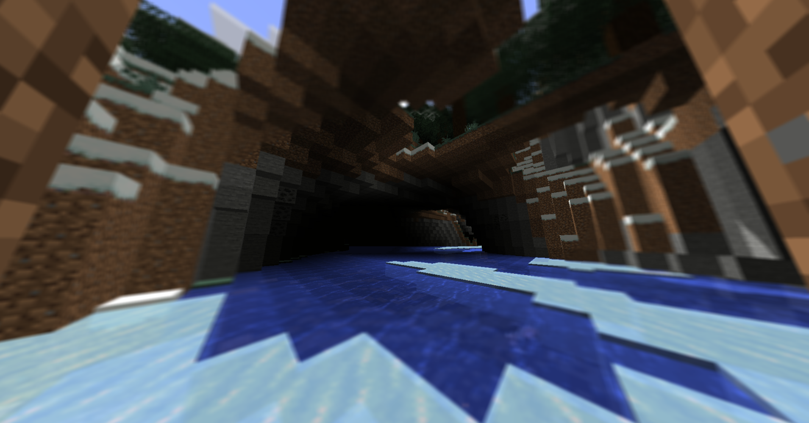
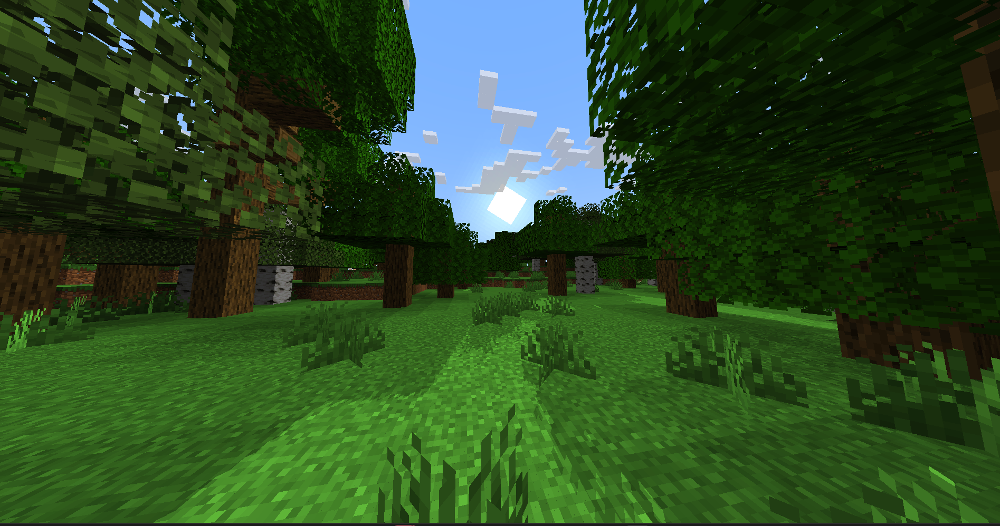
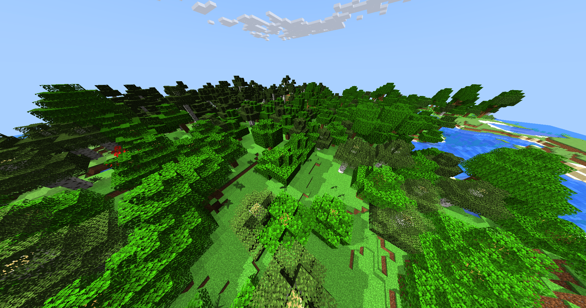
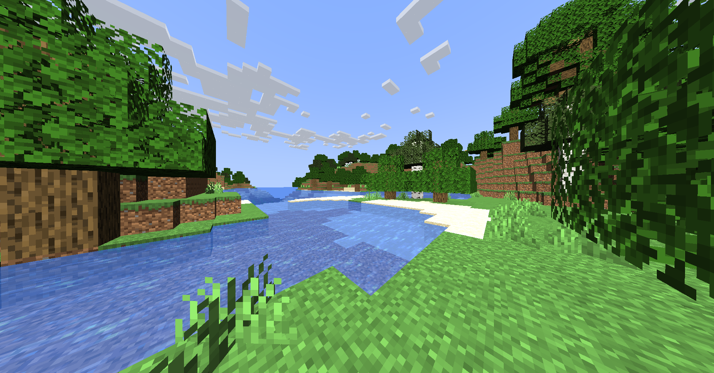
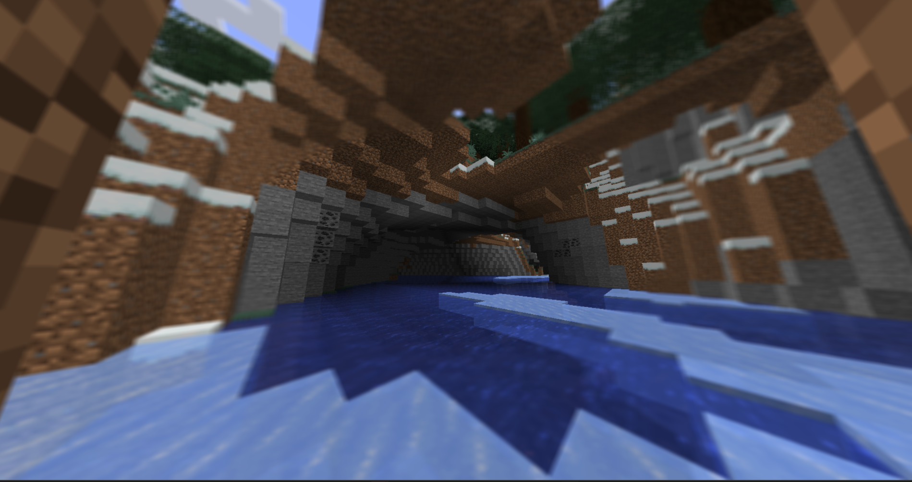

# Change v1.1

Added a new "Lambertian" lighting environment, more details can be found in the [documentation](../../docs/ambient-lighting.md).

## Screenshots

<div align="center">
  
  
  
  
  
</div>


## Enhanced terrain shadows with new calculations in file ```gbuffers_terrain.fsh```

```glsl
#version 120

// Подключаем настройки / Include settings
#include "./settings.glsl"

// Конфигурация теней / Shadow configuration
#define COLORED_SHADOWS 1       // Цветные тени / Colored shadows
#define SHADOW_BRIGHTNESS 0.75  // Яркость в тени / Shadow brightness

// Uniform-текстуры / Uniform textures
uniform sampler2D lightmap;      // Карта освещения / Lightmap
uniform sampler2D shadowcolor0;  // Цветная тень / Colored shadow
uniform sampler2D shadowtex0;    // Теневая карта (глубина) / Shadow map (depth)
uniform sampler2D shadowtex1;    // Доп. теневая карта / Additional shadow map
uniform sampler2D texture;       // Основная текстура / Main texture

// Входные данные от вершинного шейдера / Input from vertex shader
varying vec2 lmcoord;       // Координаты освещения / Lightmap coordinates
varying vec2 texcoord;      // Текстурные координаты / Texture coordinates
varying vec4 glcolor;       // Цвет вершины / Vertex color
varying vec4 shadowPos;     // Позиция в пространстве теней / Shadow space position
varying vec3 normals_face;  // Нормали поверхности / Surface normals

// Uniform-переменные / Uniform variables
uniform float sunAngle;               // Угол солнца / Sun angle
uniform vec3 shadowLightPosition;     // Позиция источника света / Light source position

// Настройки фильтрации текстур / Texture filtering settings
const bool shadowcolor0Nearest = true;
const bool shadowtex0Nearest = true;
const bool shadowtex1Nearest = true;

// Подключаем функции искажения / Include distortion functions
#include "/distort.glsl"

void main() {
    // Базовый цвет пикселя / Base pixel color
    vec4 color = texture2D(texture, texcoord) * glcolor;
    vec2 lm = lmcoord;

    // Стандартное освещение (LIGHTING_STYLES 0) / Standard lighting
    #if LIGHTING_STYLES == 0
        if (shadowPos.w > 0.0) {  // Если поверхность освещена / If surface is lit
            #if COLORED_SHADOWS == 0
                // Проверка глубины для обычных теней / Depth test for regular shadows
                if (texture2D(shadowtex0, shadowPos.xy).r < shadowPos.z) {
            #else
                // Проверка глубины для цветных теней / Depth test for colored shadows
                if (texture2D(shadowtex1, shadowPos.xy).r < shadowPos.z) {
            #endif
                // Уменьшаем яркость в тени / Reduce brightness in shadow
                lm.y *= SHADOW_BRIGHTNESS;
            }
            else {
                // Плавный переход между светом и тенью / Smooth transition between light and shadow
                lm.y = mix(31.0 / 32.0 * SHADOW_BRIGHTNESS, 31.0 / 32.0, sqrt(shadowPos.w));
                
                #if COLORED_SHADOWS == 1
                    // Добавляем цветные тени / Apply colored shadows
                    if (texture2D(shadowtex0, shadowPos.xy).r < shadowPos.z) {
                        vec4 shadowLightColor = texture2D(shadowcolor0, shadowPos.xy);
                        shadowLightColor.rgb = mix(vec3(1.0), shadowLightColor.rgb, shadowLightColor.a);
                        color.rgb *= shadowLightColor.rgb;
                    }
                #endif
            }
        }
    #endif

    // Цвета для альтернативного освещения / Colors for alternative lighting
    vec3 fire_color = vec3(0.25, 0.25, 0.);  // Огненный цвет / Fire color
    vec3 sky_color = vec3(0., 0., 1.);       // Цвет неба / Sky color

    // Альтернативное освещение (LIGHTING_STYLES 1) / Alternative lighting
    #if LIGHTING_STYLES == 1
        if (sunAngle > 0.5) {  // Если ночь / If night time
            sky_color = vec3(0.);
        }
        // Комбинируем цвета освещения / Combine lighting colors
        color.rgb = color.rgb * (fire_color * lm.x + sky_color * lm.y); 
    #endif

    // Расчет освещения по нормалям / Normal-based lighting calculation
    float lightDot = clamp(dot(normalize(shadowLightPosition), normals_face), 0., 1.);
    color.rgb = color.rgb * (
        fire_color * lm.x                           // Огненный свет / Fire light
        + texture2D(lightmap, lm).y * lm.y         // Освещение из карты света / Lightmap
        + lightDot                                 // Прямое освещение / Direct lighting
    );

    // Режим "BERSERK" (черно-белый) / BERSERK mode (grayscale)
    #if BERSEK_MOD == 1
        float average_color = (color.r + color.b + color.g) / 3.0;
        color.rgb = mix(color.rgb, vec3(average_color), 1.0);
    #endif

    // Финальное применение освещения / Final lighting application
    color *= texture2D(lightmap, lm);

    /* DRAWBUFFERS:0 */
    gl_FragData[0] = color;  // Записываем итоговый цвет в буфер / Write final color to buffer
}
```

## Modified gbuffers_terrain shaders to support normals_face in file ```gbuffers_terrain.vsh```

```glsl
#version 120

// Атрибуты вершин / Vertex attributes
attribute vec4 mc_Entity;  // ID объекта Minecraft / Minecraft entity ID

// Uniform-переменные / Uniform variables
uniform mat4 gbufferModelView;          // Матрица модели-вида для GBuffer / GBuffer model-view matrix

uniform mat4 gbufferModelViewInverse;   // Обратная матрица модели-вида / Inverse model-view matrix

uniform mat4 shadowModelView;           // Матрица модели-вида для теней / Shadow model-view matrix

uniform mat4 shadowProjection;          // Матрица проекции теней / Shadow projection matrix

uniform vec3 shadowLightPosition;       // Положение источника света / Light source position

// Выходные переменные / Varying outputs
varying vec2 lmcoord;       // Координаты освещения / Lightmap coordinates
varying vec2 texcoord;      // Текстурные координаты / Texture coordinates
varying vec4 glcolor;       // Цвет вершины / Vertex color
varying vec4 shadowPos;     // Позиция в пространстве теней / Shadow space position
varying vec3 normals_face;  // Нормали поверхности / Surface normals

// Подключаем вспомогательные функции для искажения / Include distortion helper functions
#include "/distort.glsl"

void main() {
    // Передаем текстурные координаты и координаты освещения
    // Pass texture and lightmap coordinates
    texcoord = (gl_TextureMatrix[0] * gl_MultiTexCoord0).xy;
    lmcoord  = (gl_TextureMatrix[1] * gl_MultiTexCoord1).xy;
    
    glcolor = gl_Color;
    
    // Вычисляем нормали поверхности
    // Calculate surface normals
    normals_face = normalize(gl_NormalMatrix * gl_Normal);

    // Вычисляем скалярное произведение для определения освещенности
    // Calculate dot product for lighting calculation
    float lightDot = dot(normalize(shadowLightPosition), normalize(gl_NormalMatrix * gl_Normal));
    
    #ifdef EXCLUDE_FOLIAGE
        // Особый случай для листвы - всегда освещена солнцем
        // Special case for foliage - always facing the sun
        if (mc_Entity.x == 10000.0) lightDot = 1.0;
    #endif

    vec4 viewPos = gl_ModelViewMatrix * gl_Vertex;
    
    // Если поверхность освещена (обращена к свету)
    // If surface is lit (facing the light)
    if (lightDot > 0.0) {
        // Преобразуем координаты в пространство теней
        // Transform coordinates to shadow space
        vec4 playerPos = gbufferModelViewInverse * viewPos;
        shadowPos = shadowProjection * (shadowModelView * playerPos);
        
        // Вычисляем смещение для борьбы с shadow acne
        // Calculate bias to prevent shadow acne
        float bias = computeBias(shadowPos.xyz);
        shadowPos.xyz = distort(shadowPos.xyz);
        
        // Преобразуем координаты из [-1,1] в [0,1]
        // Convert coordinates from [-1,1] to [0,1] range
        shadowPos.xyz = shadowPos.xyz * 0.5 + 0.5;
        
        #ifdef NORMAL_BIAS
            // Применяем смещение на основе нормалей
            // Apply normal-based bias
            vec4 normal = shadowProjection * vec4(mat3(shadowModelView) * (mat3(gbufferModelViewInverse) * (gl_NormalMatrix * gl_Normal)), 1.0);
            shadowPos.xyz += normal.xyz / normal.w * bias;
        #else
            // Стандартное смещение по глубине
            // Standard depth-based bias
            shadowPos.z -= bias / abs(lightDot);
        #endif
    }
    else {
        // Для неосвещенных поверхностей уменьшаем яркость
        // For unlit surfaces, reduce brightness
        lmcoord.y *= SHADOW_BRIGHTNESS;
        shadowPos = vec4(0.0);
    }
    
    shadowPos.w = lightDot;  // Сохраняем значение освещенности / Store lighting value
    gl_Position = gl_ProjectionMatrix * viewPos;  // Финальная позиция вершины / Final vertex position
}
```
